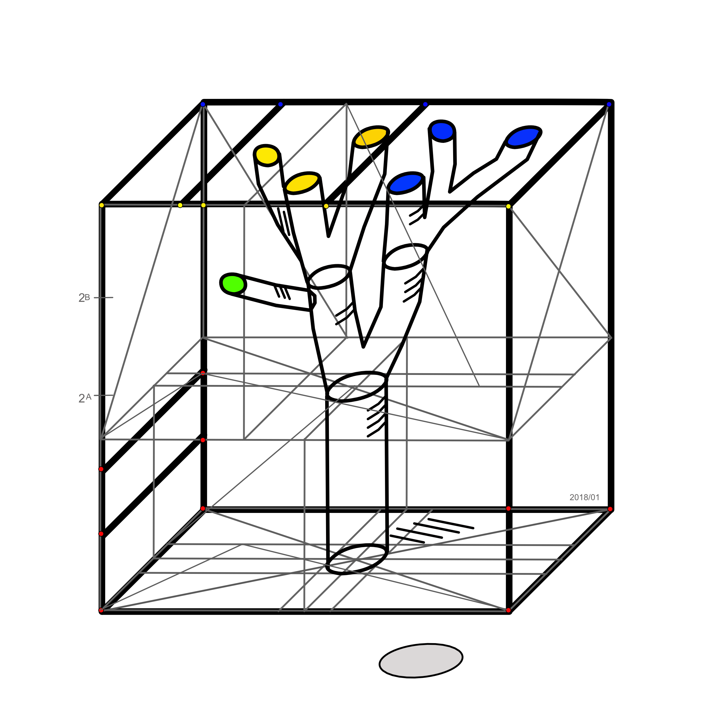

# math-roots
math: root calculation by approximation

# Date

  January 2018

# Author

  Heinz Prantner, heinz.prantner[AT]onlinehome.de

# Abstract

  How to calcualte the root of a given number x,
  where x provides a measure of size in the dimension n?

  There exists a colorful spectrum of methods to calculate root,
  with impressing names, Babylonian method (Hero’s method),
  Isaac Newton method, Bakshali method, Digit by digit calculation,
  Exponential Identity, Vedic Duplex Method, Goldschmidt’s algorithm,
  Taylor Series, Brahmagupta equation, etc.,
  [Wikipedia](https://en.wikipedia.org/wiki/Methods_of_computing_square_roots)
  enumerates and explains them.

  Iteration, Recursion and Approximation are the ingredients
  also for the approach used by the greek philosopher Zeno of Elea
  to get to the point where the fast and furious Achilles reaches
  (or not) the slow but similarly famous Tortoise.

  There are some similarities in my approach for the root calculation
  and the Achilles-Tortoise race from Zeno. Unlike the Zeno approach,
  do my iterations end at some point.

  The given paper shall document some own experimentation and considertion on the topic.
  The python code provides an implementation of the algorithm developed
  in the paper.

  

# Documentation

  [roots.pdf](pdf/roots.pdf)

# Run

  python3 py/root_app.py

# License

  [MIT](LICENSE)
